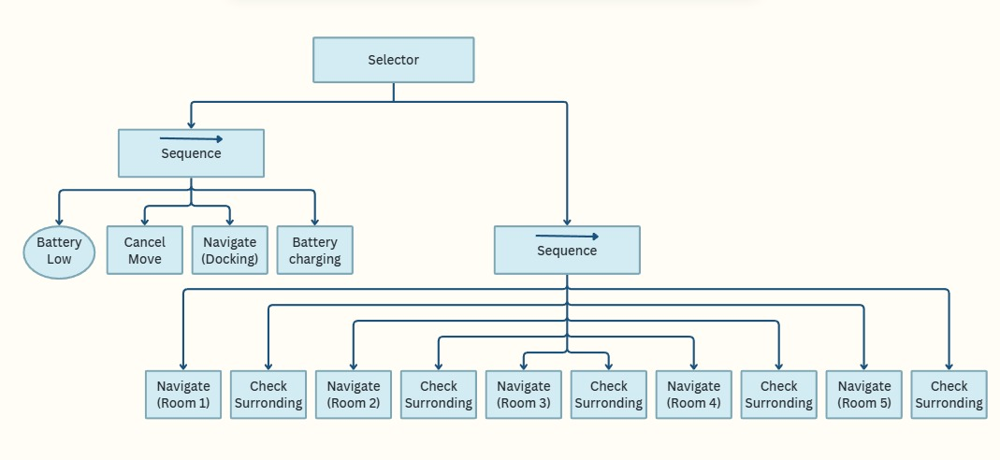
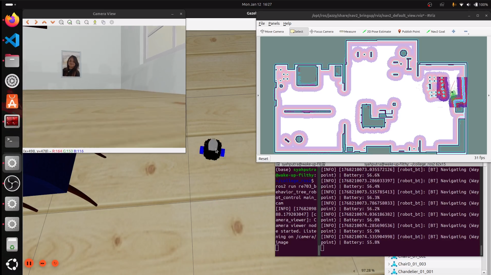

# RE703 – Behavior Tree Robot Control   
Repository ini berisi package ROS 2 yang digunakan untuk mengendalikan perilaku (behavior) robot menggunakan konsep Behavior Tree. Repository ini dibuat untuk menyelesaikan Tugas Akhir mata kuliah Kendali Robotika (RE703).

## Anggota Kelompok
Berikut adalah anggota kelompok yang terlibat dalam pengerjaan tugas ini:   
* Danni Syahputra - 4222201001
* Daipansyah Arya Saputra - 4222201009

## Behavior Tree Diagram  
Berikut adalah diagram Behavior Tree yang digunakan pada sistem kontrol robot:



## Environment dan Simulasi Robot   
Environment serta model robot yang digunakan pada project ini berasal dari repository berikut: 

https://github.com/AntoBrandi/Bumper-Bot.git    

Pada simulasi robot tersebut dilakukan sedikit modifikasi, yaitu penambahan kamera pada bagian depan robot, sehingga robot memiliki point of view (PoV) ketika robot bernavigasi. 

Seluruh sistem diuji menggunakan:

* ROS 2 Jazzy
* Gazebo Harmonic 8

Selain itu, diperlukan beberapa package pendukung untuk menjalankan environment simulasi robot. Proses instalasi dapat dilakukan dengan mengikuti panduan yang tersedia pada repository simulasi.

## Menjalankan Package Ini

Pastikan package simulasi robot telah berhasil di-build dan dijalankan terlebih dahulu, serta topic, node, dan komponen pendukung lainnya sudah aktif dan dapat terdeteksi. Setelah itu, lakukan build pada package ini dengan langkah-langkah berikut:  
```
cd your_ros2_workspace/src
git clone https://github.com/dsyahput/re703_behavior_tree_robot_control.git
cd ..
colcon build
```
Setelah proses build selesai, source workspace terlebih dahulu:
```
source install/setup.bash
```

### Menampilkan Kamera PoV Robot
Gunakan perintah berikut untuk menampilkan kamera point of view (PoV) robot:
```  
ros2 run re703_behavior_tree_robot_control main_cam
```
### Menjalankan Behavior Tree     
Gunakan perintah berikut untuk menjalankan Behavior Tree pada robot:
```
ros2 run re703_behavior_tree_robot_control main_bt
```

## Demo
Berikut adalah tampilan simulasi saat sistem sedang berjalan:



### Video demonstrasi:    
https://youtu.be/YsrWCnLyE84

